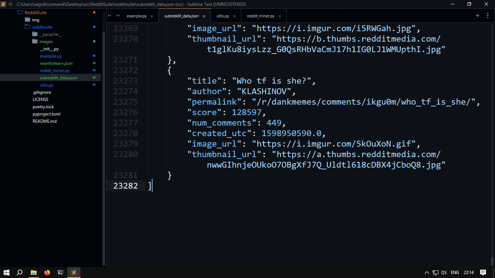

### that's a lot of data


Check out [subreddit_data.json](https://github.com/datavorous/RedditSuite/blob/main/subreddit_data.json), around 1 MB.

> [!WARNING] 
> Use with caution, Reddit might gift you with an IP ban.  
> I could extract max 2552 posts at once from 'all' using this; can't be sure about other subreddits

Try out `example.py`, things are pretty easy to understand.  
Also, `pip install googlesearch-python` beforehand.  
This script uses `data_hoarder()` to extract large amounts of post data from subreddits, saving it in a JSON format with fields like title, author, permalink, score, comments, and timestamps. If available, image and thumbnail URLs are also included.

Example data format:
```json
[
    {
        "title": "Example Title",
        "author": "AuthorName",
        "permalink": "/r/SubredditName/comments/ID/PostTitle/",
        "score": 1234,
        "num_comments": 56,
        "created_utc": 1716902623.0
    },
    {
        "title": "Example Title with Image",
        "author": "AuthorName",
        "permalink": "/r/SubredditName/comments/ID/PostTitle/",
        "score": 5678,
        "num_comments": 78,
        "created_utc": 1719949630.0,
        "image_url": "https://i.redd.it/example.png",
        "thumbnail_url": "https://a.thumbs.redditmedia.com/example.jpg"
    }
]
```
> Note: Image and thumbnail URLs are only included if available.

## Key Features:
- Extract subreddit data in bulk using `data_hoarder()`.
- Retrieve post title, body text, and top-level comments with `scrape_post_details()`.
- Download images directly using `download_image()`.

## Additional Utilities:
- Scrape posts and comments from specific users using `user_osint()`.
- Search Reddit for posts related to a query using `search_reddit()`.

### Example usage:

```python
miner.data_hoarder('all', limit=2500, category='top', output_file='hi.json')
miner.download_image('https://i.redd.it/example.jpg')
post_details = miner.scrape_post_details('/r/Subreddit/comments/ID/PostTitle/')
```

Have fun mining Reddit data!
