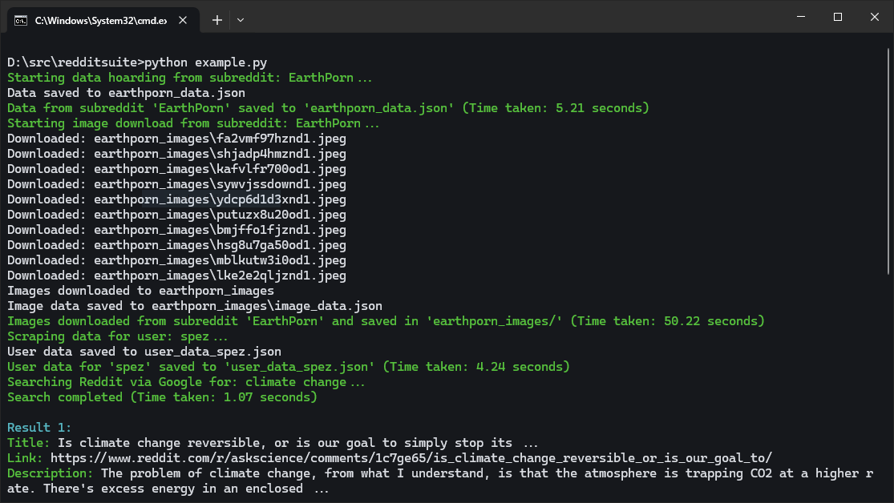
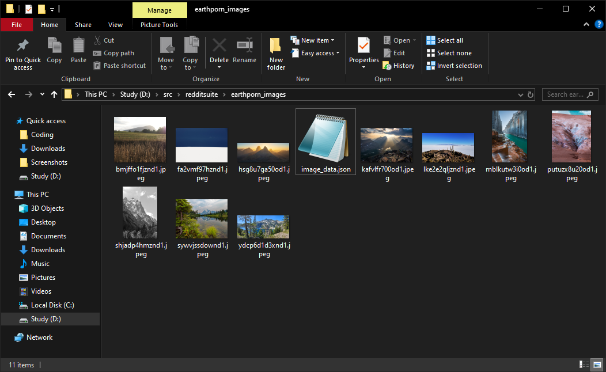
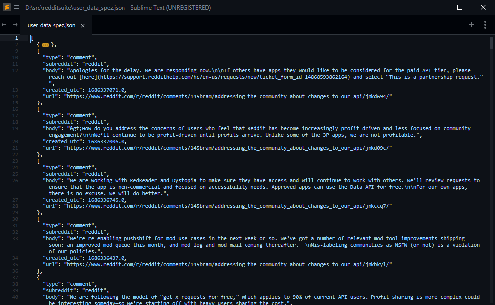
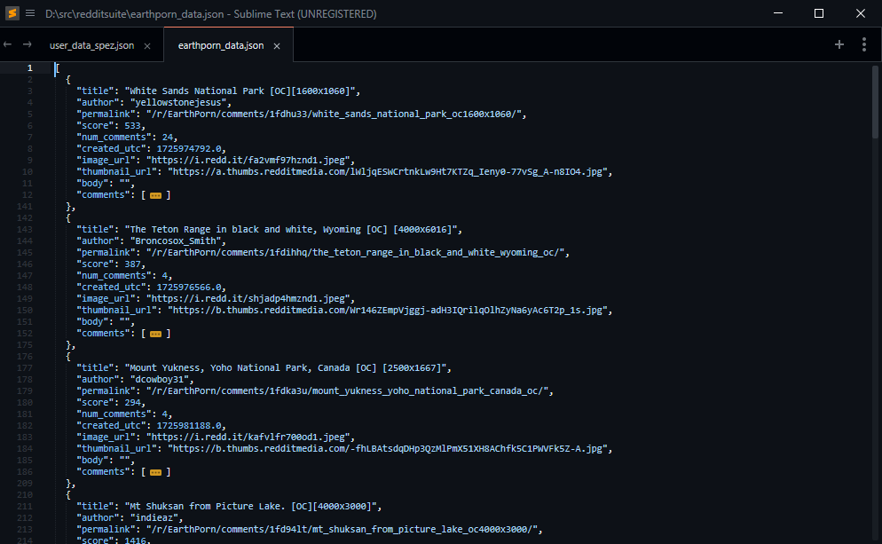

> [!WARNING] 
> Very Crude, Use at your own risk. Don't get banned.
> It's possible to fetch 3000 posts at once. (that's the max I tried, could be more)

> [!NOTE]  
> No async.

# Demo

### Fetching Posts data and Downloading Images

### Searching Reddit and Fetching Post Data

### Downloaded Images

### Fuck you spez :: data for user behaviour analysis

### Subreddit Posts :: data hoarding

## Module: `reddit_miner.py`

This module contains the `RedditMiner` class, which is responsible for scraping Reddit and performing various data extraction tasks. The class handles interacting with Reddit's JSON API and Google Search for Reddit-related content.

### Dependencies:
- `requests`: To make HTTP requests.
- `googlesearch-python`: For querying Google search results.

### Classes:

#### 1. `RedditMiner`
The `RedditMiner` class provides methods to search Reddit via Google, scrape Reddit user data, fetch subreddit posts, and scrape post details.

##### Constructor: `__init__(self, user_agent='Mozilla/5.0', proxy=None)`
- **Parameters:**
  - `user_agent` (str): The User-Agent string used in HTTP requests (default is 'Mozilla/5.0').
  - `proxy` (str): Optional proxy URL for requests.

- **Attributes:**
  - `session`: An instance of `requests.Session()` used for managing requests.

##### Methods:

1. **`search_reddit(self, query, limit=10, after=None, before=None, lang="en", sleep_interval=0)`**
   - Uses Google Search to find Reddit threads matching a given query.
   - **Parameters:**
     - `query` (str): The search query.
     - `limit` (int): The number of search results to fetch.
     - `after`, `before` (str): Optional time filters for Google search results.
     - `lang` (str): Language filter for the search.
     - `sleep_interval` (int): Sleep time between Google requests.
   - **Returns:** 
     - A list of dictionaries containing the title, link, and description of each result.

2. **`scrape_user_data(self, username, limit=10)`**
   - Scrapes a specific Reddit user's data (posts and comments).
   - **Parameters:**
     - `username` (str): The Reddit username.
     - `limit` (int): Number of posts/comments to retrieve.
   - **Returns:** 
     - A list of dictionaries containing data on each post/comment by the user.

3. **`fetch_reddit_data(self, subreddit, limit=10, category='hot', time_filter='all')`**
   - Fetches posts from a subreddit, either in the "hot" or "top" category.
   - **Parameters:**
     - `subreddit` (str): The subreddit to scrape from.
     - `limit` (int): Number of posts to retrieve.
     - `category` (str): Either 'hot' or 'top'.
     - `time_filter` (str): Time range for top posts (e.g., 'day', 'week').
   - **Returns:**
     - A list of dictionaries containing details about each post, including images if available.

4. **`scrape_post_details(self, permalink)`**
   - Scrapes detailed information from a specific Reddit post, including the post body and comments.
   - **Parameters:**
     - `permalink` (str): The permalink to the post.
   - **Returns:** 
     - A dictionary with the post title, body, and a list of comments.

5. **`_extract_comments(self, comments)`** (Internal Method)
   - Recursively extracts comments and their replies from a Reddit post.
   - **Parameters:**
     - `comments` (list): List of comments from a post.
   - **Returns:** 
     - A list of dictionaries containing comment details (author, body, replies).

---

## Module: `utils.py`

The `utils.py` module extends the functionality of `RedditMiner` with additional utilities for bulk downloading, data hoarding, and OSINT (open-source intelligence).

### Dependencies:
- `os`: For file and directory handling.
- `json`: For reading and writing JSON data.
- `requests`: For HTTP requests.
- `reddit_miner`: Inherits functionality from the `RedditMiner` class.

### Classes:

#### 1. `Utils(RedditMiner)`
This class inherits from `RedditMiner` and provides higher-level functionality, such as data hoarding, bulk image downloading, and user data scraping.

##### Constructor: `__init__(self, user_agent='Mozilla/5.0', proxy=None)`
- Inherits the constructor from `RedditMiner`.

##### Methods:

1. **`data_hoarder(self, subreddit, limit=10, category='hot', time_filter='all', output_file='subreddit_data.json')`**
   - Scrapes posts and post details from a subreddit and saves the data to a JSON file.
   - **Parameters:**
     - `subreddit` (str): The subreddit to scrape.
     - `limit` (int): Number of posts to retrieve.
     - `category` (str): Either 'hot' or 'top'.
     - `time_filter` (str): Time filter for top posts (e.g., 'day', 'week').
     - `output_file` (str): The file where the data will be saved.
   - **Returns:** 
     - None. Writes the scraped data to a JSON file.

2. **`user_osint(self, username, limit=100, output_file='user_data.json')`**
   - Scrapes a specific user's posts and comments and saves the data to a JSON file.
   - **Parameters:**
     - `username` (str): The Reddit username.
     - `limit` (int): Number of posts/comments to retrieve.
     - `output_file` (str): The file where the data will be saved.
   - **Returns:** 
     - None. Writes the user data to a JSON file.

3. **`bulk_image_downloader(self, subreddit, limit=10, category='hot', time_filter='all', output_folder='images')`**
   - Downloads images from posts in a subreddit and saves them to a local folder.
   - **Parameters:**
     - `subreddit` (str): The subreddit to scrape.
     - `limit` (int): Number of posts to retrieve.
     - `category` (str): Either 'hot' or 'top'.
     - `time_filter` (str): Time filter for top posts.
     - `output_folder` (str): Folder where images will be saved.
   - **Returns:** 
     - None. Downloads images and saves their URLs and local paths to a JSON file in the output folder.

4. **`_download_image(self, url, folder)`** (Internal Method)
   - Downloads an image from a given URL and saves it to a local folder.
   - **Parameters:**
     - `url` (str): The URL of the image to download.
     - `folder` (str): The folder where the image will be saved.
   - **Returns:** 
     - The local file path if the download is successful, or `None` if it fails.

---

### Example Use Case:
- **Subreddit Data Hoarding:** Collect all posts, comments, and image data from a subreddit.
- **User OSINT:** Gather and save the Reddit activity of a specific user.
- **Bulk Image Downloading:** Scrape and download images from a subreddit.

---

### Notes:
- Ensure you respect Reddit's API rate limits to avoid being blocked.
- Customize the `user_agent` when initializing the `RedditMiner` class to avoid bot detection.
